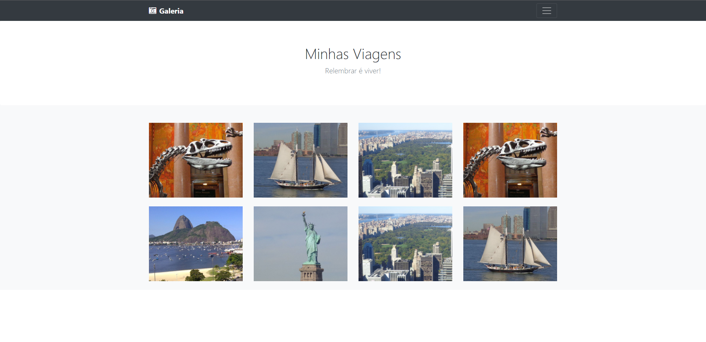

# <p align="center">🖼 Projeto Galeria 🖼</p>
<p align="center">Projeto galeria</p>
<h1 align="center">
 
  

</br>
</h1>
</br>

## 🛠 Technologies used

     


## 🚀 How to start

> clone the repository
```bash
git clone https://github.com/LuciLua/ProjetoGaleria.git
```

> open project folder
```bash
cd ./ProjetoGaleria
```

> install all packages using npm or yarn manager (using YARN)

```bash
yarn
```

> start the development server (using YARN)

```bash
yarn start
```
## 🖼 Preview


